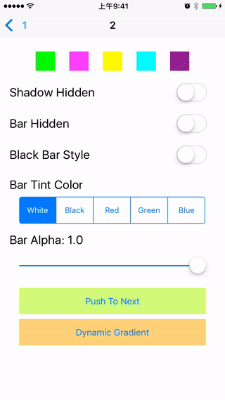
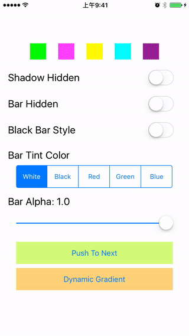
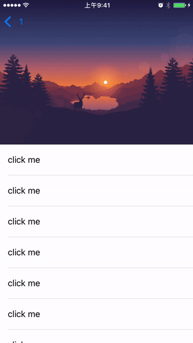
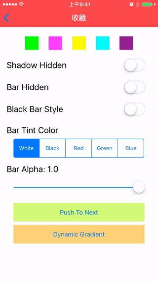
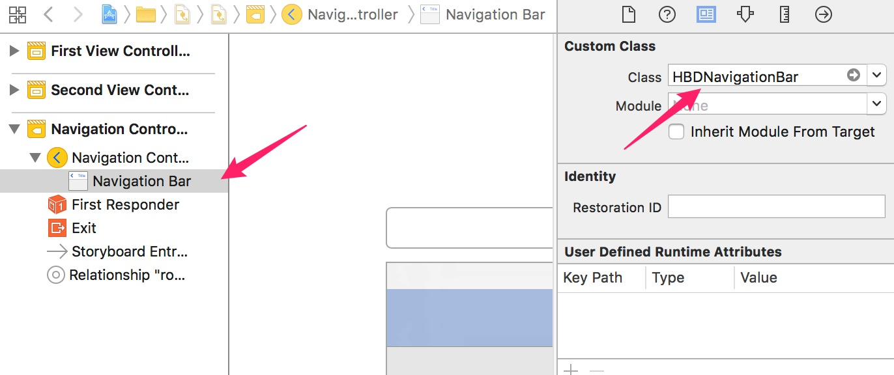

# HBDNavigationBar

An aspiring UINavigationBar. 

[中文文档](https://github.com/listenzz/HBDNavigationBar/blob/master/README_CN.md)

##  Introduction

### Smoothly switch between displaying and hiding shadow image




### Smoothly switch between navigation bar presence or absence

Different from calling `setNavigationBarHidden:animated:`



### Switch background transparency



### Smooth transitions between different backgrounds




## Usage

The above effects are the result of the collaboration of the three classes:

HBDNavigationBar inherit UINavigationBar

HBDNavigationController inherit UINavigationController, using HBDNavigationBar internally

UIViewController (HBD) is a category with some configurable properties

```objc
@property (nonatomic, assign) UIBarStyle hbd_barStyle;   // barStyle
@property (nonatomic, strong) UIColor *hbd_barTintColor; // bar background color
@property (nonatomic, strong) UIImage *hbd_barImage;     // bar background image
@property (nonatomic, strong) UIColor *hbd_tintColor;    // bar button item color
@property (nonatomic, strong) NSDictionary *hbd_titleTextAttributes; // title text attributes
@property (nonatomic, assign) float hbd_barAlpha;        // bar background alpha
@property (nonatomic, assign) BOOL hbd_barHidden;        // whether the navigation bar should hidden
@property (nonatomic, assign) BOOL hbd_barShadowHidden;  // whether the shadow image should hidden
@property (nonatomic, assign) BOOL hbd_backInteractive;  // whether the current controller shold responds to back gesture interactive , the default value is YES
```

Actual use is very simple:

```objc
// HBDNavigationController is only used when creating UINavigationController
// HBDNavigationBar only has the opportunity to appear when storyboard is used
DemoViewController *vc = [[DemoViewController alloc] init];
self.window.rootViewController = [[HBDNavigationController alloc] initWithRootViewController:vc];
```

Configure the desired effect by category properties in `viewDidLoad`

```objc
@implementation DemoViewController
- (void)viewDidLoad {
    [super viewDidLoad];
    // Hide the navigation bar, this way, no need to call `setNavigationBarHidden:animated:`
    // Do not need to worry about other controllers will be affected
    self.hbd_barHidden = YES; 
}
@end
```

If you use storyboard, don't forget to set HBDNavigationBar apart from setting HBDNavigationController.



### Attention and Limitation

`hbd_barHidden` does not really hide the navigation bar, it just makes it transparent.

Once you set the background image with `hbd_barImage`, `hbd_barTintColor` will fail

The background algorithm are as follows:

1. Whether `hbd_barImage` has a value, if there is, set to background, otherwise the next step
2. Whether `hbd_barTintColor` has a value, if there is, set to background, otherwise the next step
3. Whether `[[UINavigationBar appearance] backgroundImageForBarMetrics:UIBarMetricsDefault]` has a return value, if there is, set to background, otherwise the next step
4. Whether `[UINavigationBar appearance].barTintColor` has a value, if there is, set it as the background, otherwise the next step
5. Calculate the default background color based on barStyle and set it as the background

If you use a image to set the background and you want transparency, use a image with transparency.

If the blur effect is required, the value set to `hbd_barTintColor` should has alpha component. Do not use the `hbd_barAlpha` to adjust the blur effect.

Image as background has no blur effect.

`isTranslucent` is always YES, which means that the controller's view is always under the navigation bar.

A good practice is to set the global style via `[UINavigationBar appearance]` and then fine-tune the `viewDidLoad` on each view controller, if necessary.

```objc
- (BOOL)application:(UIApplication *)application didFinishLaunchingWithOptions:(NSDictionary *)launchOptions
{
    [[UINavigationBar appearance] setBarTintColor:...];
    // ...
    return YES;
}
```

## 感谢

在完善导航栏相关功能时，查看了 GitHub 上十多个相关项目，其中给我帮助最大的是 [YPNavigationBarTransition](https://github.com/yiplee/YPNavigationBarTransition)，它为我解决不同背景之间如何平滑切换提供了非常有价值的参考。


## Requirements

iOS 8+

## Installation

HBDNavigationBar is available through [CocoaPods](http://cocoapods.org). To install
it, simply add the following line to your Podfile:

```ruby
pod 'HBDNavigationBar', '~> 1.2.1'
```

## License

HBDNavigationBar is available under the MIT license. See the LICENSE file for more info.
